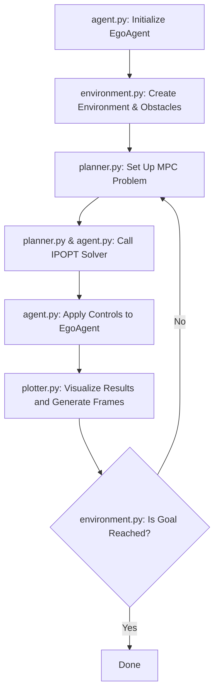

# MPC Folder Documentation

## Overview
This folder contains implementations for Model Predictive Control (MPC).  
It includes:
- Agents (EgoAgent, ShadowAgent) that integrate with a planner
- Obstacles (static/dynamic) to simulate environments

## Usage
1. Install dependencies like CasADi, NumPy, matplotlib.
2. Run the environment loops (LocalEnvironment or ROSEnvironment).
3. Example usage can be found in the examples folder.

## Solver
We use the IPOPT (Interior Point OPTimizer) solver through CasADi.  
It solves large-scale nonlinear optimization problems using an interior-point approach,
allowing efficient numeric solutions for MPC setups.

## Flowchart

## File Descriptions
- agent.py: Defines Agent and EgoAgent classes handling motion and state updates.
- environment.py: Handles environment setup, stepping logic, and waypoint tracking.
- obstacle.py / dynamic_obstacle.py: Implements obstacle classes with distance calculations.
- planner.py: Contains the MotionPlanner for trajectory optimization.
- plotter.py: Offers plotting functionalities for agent/obstacles states visualization.

